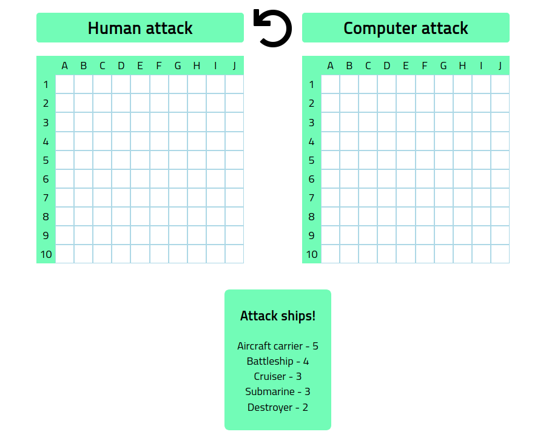

# Battleship

Battleship is a game app; it has two players those are computer vs human.<br />

- When the game starts, the computer and human have each board with hidden located ships.<br />
- The human player tries attacking one each time, miss-attack hits water which has water-colour.<br />
- And human attacks the located ship, the hit ship has a red colour, and sunk ship changes dark-grey colour.<br />
- If one of the players attacks all the ships, the player wins the game.<br />

Ships
- Aircraft carrier(5)
- Battleship(4)
- Cruiser(3)
- Submarine(3)
- Destroyer(2)

This is a part of [the Odin Project](https://www.theodinproject.com/courses/javascript/lessons/battleship).



## Technologies

- Javascript: ECMAScript 2015 (es6)
- Jest test
- HTML 5
- CSS 3

## Deployment

#### [Live Demo](https://shjang7.github.io/battleship/dist/index.html)

## Getting started

> Clone the repository to your local machine

```
$ git clone https://github.com/shjang7/battleship.git
```

> Change directory into the directory

```
$ cd battleship
```

> Install npm

```
$ npm install
```

> Test check no errors. When it passes, move on.

```
$ npm test
```

> Build codes

```
$ npm run build
```

> Open server

```
$ npm run server
```

> Go to execution file directory in your browser

```
./dist/index.html
```

> Read the game rule at first screen; the game rule will decrease the size after some moment.

```
```

## Contributors

This is a collaborative project by us: [Suhyeon Jang](https://github.com/shjang7) and [Grace Mugoiri](https://github.com/grace-mugoiri)

## Contributing

1. Fork it (https://github.com/shjang7/battleship/fork)
2. Create your feature branch (git checkout -b feature/[choose-a-name])
3. Commit your changes (git commit -am 'what this commit will fix/add')
4. Push to the branch (git push origin feature/[chosen-name])
5. Create a new Pull Request

## License

This project is licensed under the MIT License - see the [LICENSE](./LICENSE) file for details
